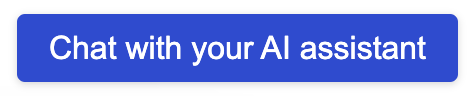
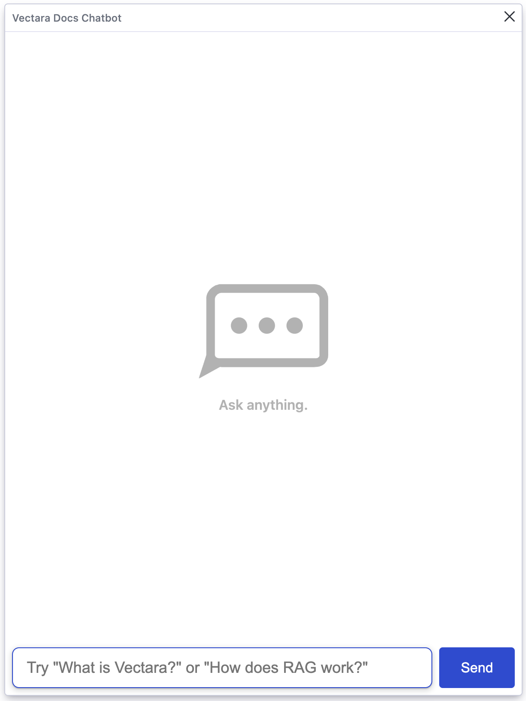
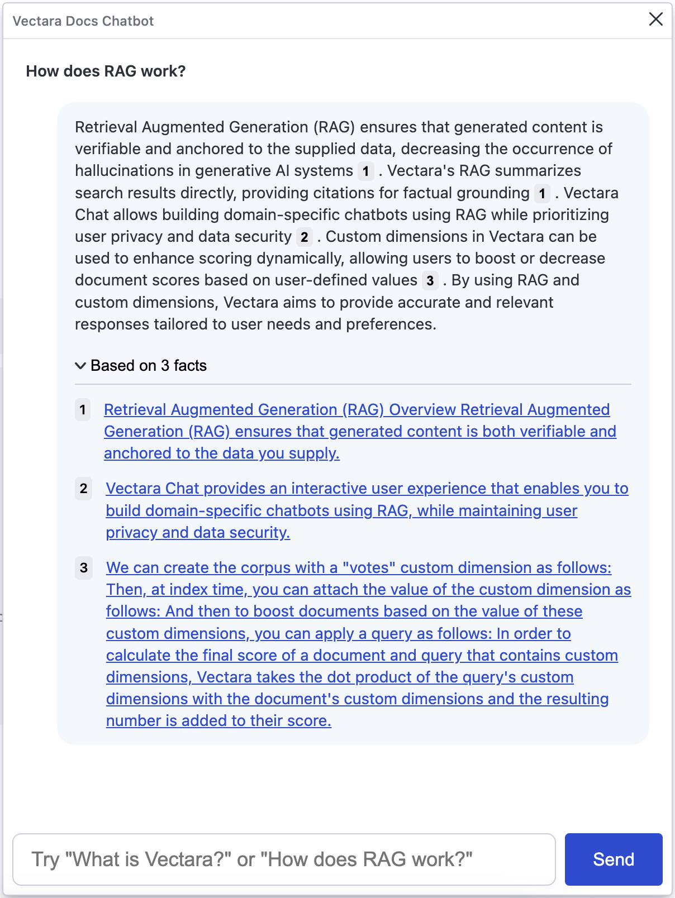
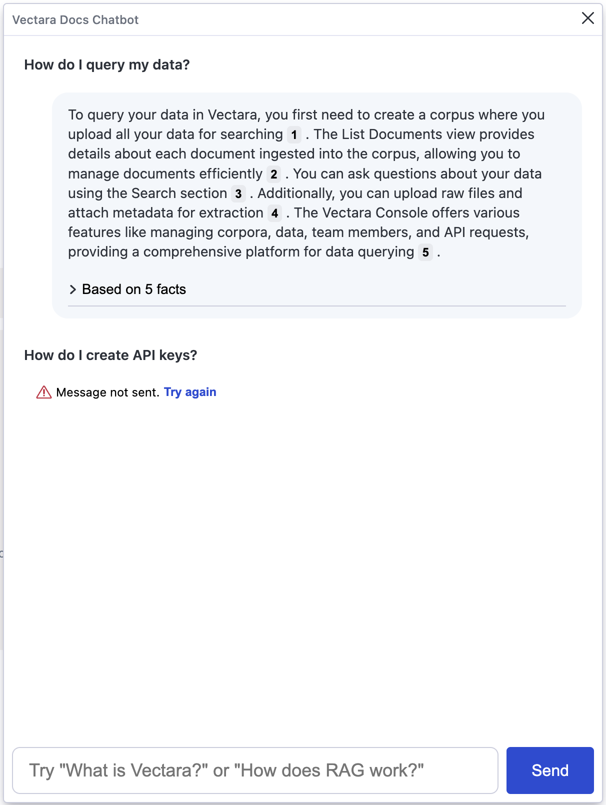
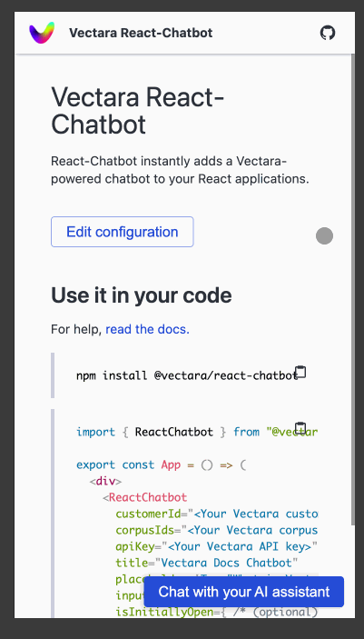

<p align="center">
  
</p>

# React-Chatbot

React-Chatbot is a UI widget for adding [Vectara](https://vectara.com/)-powered chatbot to your React apps with a few lines of code.

> [!TIP]
>
> Looking for something else? Try another open-source project:
>
> - **[React-Search](https://github.com/vectara/react-search)**: Add Vectara semantic search to your React apps with a few lines of code.
> - **[Create-UI](https://github.com/vectara/create-ui)**: The fastest way to generate a working React codebase for a range of generative and semantic search UIs.
> - **[Vectara Answer](https://github.com/vectara/vectara-answer)**: Demo app for Summarized Semantic Search with advanced configuration options.
> - **[Vectara Ingest](https://github.com/vectara/vectara-ingest)**: Sample templates and crawlers for pulling data from many popular data sources.

## Demo

**[Try out the demo!](https://vectara.github.io/react-chatbot/)**

## UI

React-Chatbot adds a button to the lower right corner of your application:

</img>

When the button is clicked, a chat window opens, where your users can start a conversation with your data:

</img>

The Vectara platform responds to user messages and presents a list of references that support its answer:

</img>

When the chat API returns an error, the UI allows the user to retry sending the message:

</img>

React-Chatbot is also ready for use on mobile sites, taking the fullscreen when the chat window is opened:

</img>

## Use it in your application

### Use the chatbot directly

Install React-Chatbot:

```shell
npm install --save @vectara/react-chatbot
```

Then use it in your application like this:

```js
import { ReactChatbot } from "@vectara/react-chatbot";

/* snip */

<ReactChatbot
  customerId="CUSTOMER_ID"
  corpusIds={["CORPUS_ID_1", "CORPUS_ID_2", "CORPUS_ID_N"]}
  apiKey="API_KEY"
  title="My Chatbot"
  placeholder="Chat with your AI assistant"
  inputSize="large"
  emptyStateDisplay={<MyEmptyStateDisplayComponent />}
  isInitiallyOpen={false}
  zIndex={ /* (optional) number representing the z-index the component should have */ }
  enableStreaming={true}
  language="fra"
/>
```

#### <u>Configuration Options</u>

##### `customerId` (required)

Every Vectara account is associated with a customer ID. You can find your customer ID by logging into the [Vectara Console](https://console.vectara.com/) and opening your account dropdown in the top-right corner.

##### `corpusIds` (required)

After you [create a corpus](https://docs.vectara.com/docs/console-ui/creating-a-corpus), you can find its ID by navigating to the corpus and looking in the top-left corner, next to the corpus name.

##### `apiKey` (required)

API keys enable applications to access data inside of corpora. Learn how to [create a **QueryService** API key](https://docs.vectara.com/docs/console-ui/manage-api-access#create-an-api-key).

##### `title` (optional)

Configure the title in the header of the chatbot window.

##### `placeholder` (optional)

Configure the placeholder text in the chatbot's input.

##### `emptyStateDisplay` (optional)

Configure JSX content to render in the messages window when there are no messages to display.

##### `isInitiallyOpen` (optional)

Set the chat window to be opened on initial render.

##### `inputSize` (optional)

Control the size of the input - either "large" (18px) or "medium" (14px)

##### `zIndex` (optional)

Customize the z-index of the chatbot widget

##### `enableStreaming` (optional)

Enable streaming responses from the Vectara API. Defaults to true.

##### `language` (optional)

The language the response should be in. Defaults to "eng" for English.
See our [types](src/types.ts) for more information on supported language values.

### Use your own views with the useChat hook

Install React-Chatbot:

```shell
npm install --save @vectara/react-chatbot
```

Then use the `useChat` hook in your application like this:

```js
import { useChat } from "@vectara/react-chatbot/lib/useChat";

/* snip */

const { sendMessage, activeMessage, messageHistory, isLoading, isStreamingResponse, hasError, startNewConversation } =
  useChat(
    "CUSTOMER_ID",
    ["CORPUS_ID_1", "CORPUS_ID_2", "CORPUS_ID_N"],
    "API_KEY",
    true, // Enable streaming, false otherwise. Defaults to true.
    "fra" // Response language. Defaults to "eng" for English. See our types for more information.
  );
```

The values returned by the hook can be passed on to your custom components as props or used in any way you wish.

#### <u>Hook Values</u>

##### sendMessage: `async ({ query: string; isRetry?: boolean }) => void;`

This is used to send a message to the chat API. Send `true` for the optional `isRetry` flag to if this is retrying a previously failed message. This allows the internal logic to correctly link the next successful answer to the failed query.

##### activeMessage: `ChatTurn`

This is the current message that is currently awaiting a response, or being responded to, by the API.

##### startNewConversation: `() => void;`

This is used to reset the conversational context of the chat. The message history will be cleared and the chatbot will "forget" everything that's been discussed.

##### messageHistory: `ChatTurn[]`

This is an array of objects representing question and answer pairs from the entire conversation. Each pair is a `ChatTurn` object. More information on types can be found [here](src/types.ts).

##### isLoading: `boolean`

A boolean value indicating whether or not a chat API request is still pending

##### isStreamingResponse: `boolean`

A boolean value indicating whether or not the API is still streaming a response to the browser. (Only available if streaming is enabled)

##### hasError: `boolean`

A boolean value indicating whether or not the most recent chat API request encountered an error

### Usage with SSR Frameworks

Using React-Chatbot with SSR frameworks may require additional infrastructure. Here are some common gotchas:

#### Next.js

Since React-Chatbot requires a few browser-only features to function, we need to defer the rendering of the component to the client. In order to do this, you will need to:

1. Use the `"use client"` directive in the file that imports React-Chatbot.
2. Use a one-time `useEffect` call in React-Chatbot's consumer. The useEffect callback should import and set the rendered widget as a state on the consumer component. We do the import here as some declarations in imported file also require resources only available in the browser.
3. Include the rendered widget state value in the rendered consumer component.

Example:

```
"use client";

export const App = (props: Props): ReactNode => {
  const [chatWidget, setChatWidget] = useState<ReactNode>(null);

  /* the rest of your code */

  useEffect(() => {
    const importAndCreateWidget = async () => {
      const { ReactChatbot } = await import("@vectara/react-chatbot");

      setChatWidget(
        <ReactChatbot
          customerId="CUSTOMER_ID"
          corpusIds={["CORPUS_ID_1", "CORPUS_ID_2", "CORPUS_ID_N"]}
          apiKey="API_KEY"
        />
      );
    }

    importAndCreateWidget();
  }, []);

  return (
    <>
      { /* other content */ }
    </>
  )
};

```

### Set up your data

React-Chatbot uses the data in your Vectara corpus to provide factual responses. To set this up:

1. [Create a free Vectara account](https://console.vectara.com/signup).
2. [Create a corpus and add data to it](https://docs.vectara.com/docs/console-ui/creating-a-corpus).
3. [Create a **QueryService** API key](https://docs.vectara.com/docs/console-ui/manage-api-access#create-an-api-key).

**Pro-tip:** After you create an API key, navigate to your corpus and click on the "Access control" tab. Find your API key on the bottom and select the "Copy all" option to copy your customer ID, corpus ID, and API key. This gives you all the data you need to configure your `<ReactChat />` instance.


## Maintenance

This codebase comes with a development environment to facilitate enhancements and bug fixes. It allows maintainers to quickly iterate on the code and verify changes instantly.

### Running the development environment

From the root directory, run:

```
npm run installAllDependencies
```

This completes the following steps:

- installs dependencies for React-Chatbot
- builds React-Chatbot
- installs the freshly-built React-Chatbot package in the docs site directory

Once this completes, run:

```
npm run docs
```

This spins up an application running at `http://localhost:8080/`. Your latest changes will be reflected here.

### Making changes to the component

Once the development environment is running, any changes made to .ts and .tsx files in the `/src` directory will trigger a rebuild of the component and a reload of the webpage.

Additionally, any changes to the development app source code at `/docs/index.tsx` will also trigger a rebuild + reload.

## License

Vectara React-Chatbot is an open-sourced software licensed under the [Apache 2.0 license](/LICENSE).

_This repository contains sample code that can help you build UIs powered by Vectara, and is licensed under the Apache 2.0 License. Unless required by applicable law or agreed to in writing, software distributed under the License is distributed on an "AS IS" BASIS, WITHOUT WARRANTIES OR CONDITIONS OF ANY KIND, either express or implied. See the License for the specific language governing permissions and limitations under the License._
